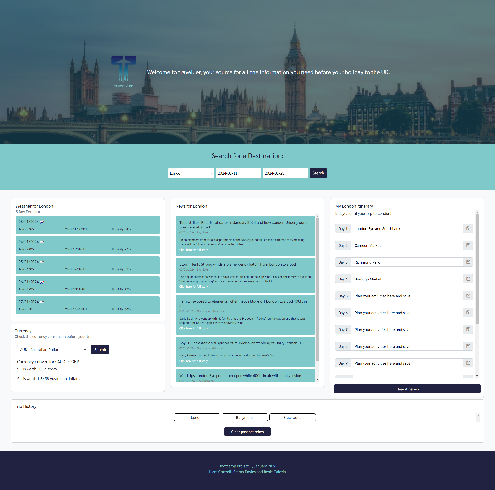

# travel.ler v1

  

## Description
A dashboard to display information for visitors to the UK :airplane:

Whatever your destination, travel.ler will give you all the information you need about the weather 🌦, the news 🗞️, and exchange rates 💰

Enjoy your stay in the UK! 🇬🇧

### Project Deliverables
To meet the project Acceptance Criteria, the app:
- Uses at least two server-side APIs ✅ 
  - OpenWeather
  - FreecurrencyAPI
  - GNews
- Uses client-side storage to store persistent data ✅ 
  - Search history saved automatically
  - User can choose to save tinerary
  - User can choose to clear any/all saved data
- Is interactive (accepts and responds to user input) ✅ 
  - Accepts user selection via dropdown menu and date picker
  - Responds to user choices to save/clear data
- Uses Bootstrap ✅ 
  - Cards
  - Twelve column grid system
  - Buttons
- Uses modals ✅ 
- Is responsive ✅ 
- Is deployed to GitHub Pages ✅ 
- Has a polished UI ✅
- Has a clean repository ✅
- Meets technical acceptance criteria ✅ including:
  - Multiple descriptive commits
  - Even split between group members
  - Following best practice, e.g. naming conventions
  - Etc.

### Installation
No installation required.

### Usage
👨‍💻 The webpage can be viewed at https://lico27.github.io/travelLER 
👨‍💻 The CSS can be viewed in the repository at Assets/css/styles.css 
👨‍💻 The JavaScript files can be viewed at Assets/js/script.js (main script) and /cities.js (array/function for dropdown menu)

- Select your destination from the dropdown menu, choose your departure and return dates from the date pickers, and click Search
- Your past searches are saved in a list - click on a city name to recall the data for that city
- Click 'Clear saved searches' to delete past saves
- **To use the itinerary:** 
  - Type itinerary details into the boxes (one per day of your trip) and click Save
  - Click 'Clear itinerary' to delete past saves
- **To view currency exchange rates:**
  - Select your home currency from the dropdown menu and click Submit

### Screenshot

## Credits
👏 Project designed and built by [Liam Cottrell](https://github.com/lico27), [Emma Davies](https://github.com/E-Davies) and [Rosie Galezia](https://github.com/rosiegalezia) 
👏 https://bootstrapcolors.com was used to generate CSS for custom buttons with bootstrap-style hover effects 
👏 Image credit: [Pixabay](https://www.pexels.com/photo/big-ben-bridge-castle-city-460672/)

## License
Produced under the MIT license.

## Badges

